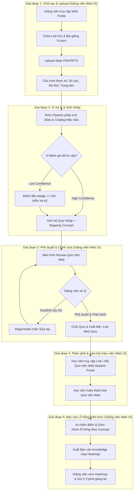

# User Flow Giảng Viên & Học Viên — VLearn Assessment Agent (Web Platform)

> **Sản phẩm:** VLearn Assessment Agent (AI Tạo Quiz & Phát hiện Lỗ hổng Học tập)  
> **Nền tảng:** Web Platform (Giảng viên & Học viên chỉ hoạt động trên giao diện Web).  
> **Job Executor:** Giảng viên / Tutor chuẩn bị bài kiểm tra đánh giá & theo dõi mức độ hiểu bài của lớp học.  
> **Lát cắt MỘT CÂU:** Khi Giảng viên cần kiểm tra mức độ hiểu bài của lớp, VLearn Assessment Agent tự động quét Slide vLearn để tạo bộ Quiz chuẩn hóa kèm Báo cáo Lỗ hổng Kiến thức (Knowledge Gap Heatmap), giúp Giảng viên biết chính xác phần kiến thức cần giảng lại chỉ trong 3 phút.

---

## 1. Sơ đồ Luồng Trải Nghiệm (Mermaid Flowchart)

---

## 2. Chi Tiết Các Bước Trong Luồng (Step-by-Step Journey)

### Giai đoạn 1: Khởi tạo & Upload Tài liệu (`Input - Lecturer Web UI`)
- **Hành động của Giảng viên:** 
  1. Đăng nhập Web Dashboard của VLearn Assessment Agent.
  2. Chọn môn học / lớp học tương ứng (ví dụ: *AI Product Hackathon - Batch 03*).
  3. Upload tài liệu bài giảng (file Slide PDF/PPTX) hoặc chọn bài giảng có sẵn từ VLearn.
  4. Nhanh chóng chọn cấu hình Quiz (ví dụ: 5-10 câu, dạng Trắc nghiệm / Đúng Sai, Mức độ: Nhận biết / Thông hiểu / Vận dụng).
- **Trải nghiệm UX:** Drag & drop file đơn giản, chọn nhanh tham số để hoàn thành trong **15 giây**.

### Giai đoạn 2: AI Processing (`Augmentation & Generation`)
- **Hệ thống AI xử lý (RAG Pipeline):**
  - Trích xuất kiến thức cốt lõi từ Slide.
  - Mining dữ liệu lịch sử thắc mắc (từ `chat_history_anonymized_for_hackathon.csv`) để phát hiện các khái niệm học viên hay hiểu sai.
  - Sinh bộ câu hỏi trắc nghiệm kèm:
    - Đáp án đúng + Giải thích chi tiết.
    - Tag khái niệm tương ứng (Concept Mapping).
    - Chỉ số độ tin cậy (Confidence Score).

### Giai đoạn 3: Phê duyệt & Chỉnh sửa (`Human-in-the-Loop Review Gate - Lecturer Web UI`)
- **Vì sao có bước này:** Tránh sai lệch kiến thức hoặc câu hỏi mập mờ (Cost of Error cao).
- **Hành động của Giảng viên:**
  - Xem danh sách câu hỏi nháp được xếp theo từng Concept trên giao diện Web.
  - Nếu câu hỏi chưa ưng ý: Nút `Regenerate` (Sinh câu khác) hoặc tự `Edit inline` văn bản.
  - Nhấn nút **[Phê duyệt & Phát hành Quiz]**.
- **Trải nghiệm UX:** Giao diện Web dạng Card View rõ ràng, hiển thị badge cảnh báo ⚠️ ở các câu AI chưa tự tin 100%.

### Giai đoạn 4: Phân phối & Làm bài (`Student Web UI`)
- **Hành động của Học viên:**
  - Đăng nhập vào **Student Web Portal** hoặc truy cập theo Link / Mã Quiz được Giảng viên chia sẻ.
  - Trực tiếp trả lời các câu hỏi trắc nghiệm trên Web (tương thích cả Mobile Browser & Desktop).
  - Nộp bài ➔ Xem đáp án giải thích ngay trên Web.

### Giai đoạn 5: Báo cáo Lỗ hổng Kiến thức (`Knowledge Gap Heatmap - Lecturer Web UI`)
- **Hành động của Giảng viên:**
  - Mở tab **[Báo cáo Lỗ hổng / Heatmap]** trên Dashboard sau khi học viên làm bài.
  - Quan sát ma trận nhiệt (Heatmap) thể hiện:
    - 🔴 **Vùng đỏ (Lỗ hổng nặng):** Khái niệm >40% lớp trả lời sai (ví dụ: *RAG Pipeline Architecture*).
    - 🟡 **Vùng vàng (Cần củng cố):** Khái niệm 15-40% lớp chưa vững.
    - 🟢 **Vùng xanh (Đã nắm vững):** Khái niệm >85% trả lời đúng.
  - AI đề xuất sẵn: *"Gợi ý 3 phút giảng lại cho buổi học sau: Tập trung giải thích phân biệt Dense Retrieval vs Sparse Retrieval"*.

---

## 3. Bốn Đường Đi Của Trải Nghiệm (4 Paths of Experience)

| Đường đi | Tình huống | Cách hệ thống & Giảng viên xử lý trên Web |
|---|---|---|
| **1. Happy Path (Luồng chuẩn)** | Slide đầy đủ chữ & cấu trúc rõ ràng. | AI sinh Quiz trong 10s ➔ Giảng viên duyệt trên Web ➔ Học viên làm trên Web ➔ Heatmap hiển thị đầy đủ, chính xác. |
| **2. Low-confidence Path (Độ tin cậy thấp)** | Slide quá nhiều hình ảnh / ít chữ / câu từ mập mờ. | AI đánh dấu badge ⚠️ *"Thông tin trong slide mỏng"*, gợi ý Giảng viên kiểm tra lại đáp án hoặc bổ sung context trên Web Editor. |
| **3. Correction Path (Giảng viên sửa đổi)** | Giảng viên muốn đổi đáp án hoặc sửa lại câu hỏi. | Giảng viên sửa trực tiếp trên Web UI ➔ Hệ thống lưu log chỉnh sửa để cải thiện Prompt/Model. |
| **4. Failure/Outside Scope Path (Lỗi tài liệu / Ngoại lệ)** | Upload sai định dạng file (vd: file video, zip) hoặc slide hoàn toàn trống. | Web Dashboard báo lỗi thân thiện: *"Không thể đọc nội dung file. Vui lòng upload định dạng PDF/PPTX"* kèm nút upload lại. |

---

## 4. Phân Công Trách Nhiệm Xây Dựng Flow (Team Roles)

- **Kiên:** Agent Core & RAG Pipeline (Xử lý Slide PDF ➔ Sinh Quiz Nháp).
- **Phúc:** Frontend UI/UX Web Platform (Web App Giảng viên: Review Quiz/Heatmap & Web Portal Học viên: Làm Quiz).
- **Thiện:** Prompt Engineering & Concept Mapping (Prompt tạo câu hỏi, giải thích, và gán tag Concept).
- **Hưng:** Data Evidence & Evaluation (Khai phá dữ liệu chatlog ➔ Tích hợp thông tin lỗ hổng thực tế).
- **Thắng:** Integration & API (Backend Web API, kết nối Frontend Web ➔ RAG Engine).
- **Đức:** AI Spec & Validation (Kiểm định bộ câu hỏi, tính chính xác & xây dựng Golden Set).
